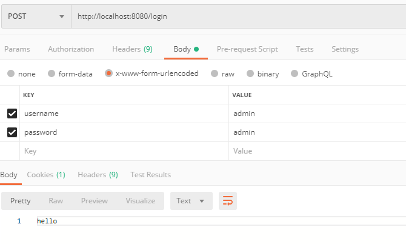
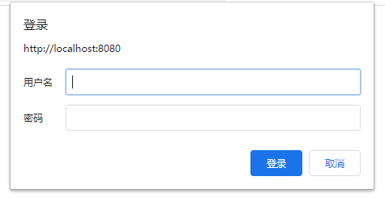
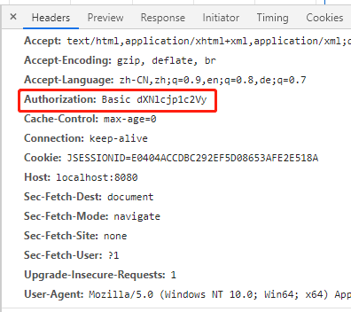

# spring-boot-demo-security

[toc]

## 原理

Spring Security 是基于 FilterChain 模式对请求进行安全认证，其用到的 Filter 功能如下：

| 过滤器                                | 功能                                                         |
| ------------------------------------- | ------------------------------------------------------------ |
| FilterHandler$FilterChainImpl         | FilterChain接口的实现类，负责将HTTP请求交给Filter处理        |
| DelegatingFilterProxyRegistrationBean | Filter实现类，负责将 DelegatingFilterProxy 注册到 ServletContext 中 |
| DelegatingFilterProxy                 | Filter实现类，负责将HTTP请求交给FilterChainProxy处理         |
| FilterChainProxy                      | 实现Filter接口的Bean，持有多个SecurityFilterChain，负责将HTTP请求交给其中一个SecurityFilterChain处理 |
| SecurityFilterChain                   | 持有多个 Spring Security Filter                              |
| UsernamePasswordAuthenticationFilter  | 表单登录时用到的Filter                                       |
| BasicAuthenticationFilter             | Basic认证时用到的Filter                                      |

## 登录认证方式

Spring Security 提供了两种登录认证方式，Basic认证（默认）和表单登录认证。

### 表单登录认证

浏览器表单登录认证页面：

浏览器请求如图：

通过Postman表单登录：

### HTTP Basic 认证

Baisc认证其实就是在请求头中添加“Authentication”参数，参数值为“Basic”+空格+“用户名:密码”字符串Base64编码后的值

浏览器认证界面：

浏览器请求如图：

Postman认证方法：

注意是GET请求而不是POST，路径是 /hello 而不是 /login

参考：https://blog.csdn.net/wangb_java/article/details/86502166

